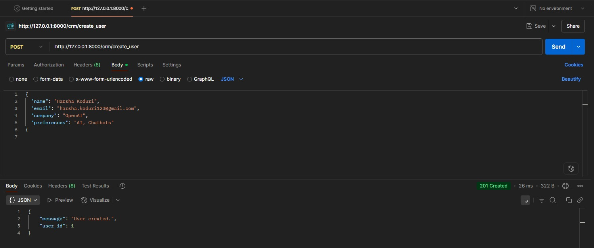
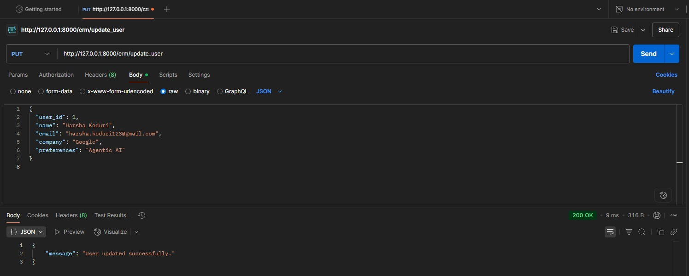
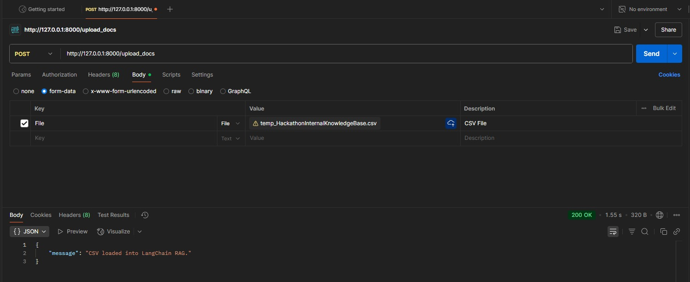
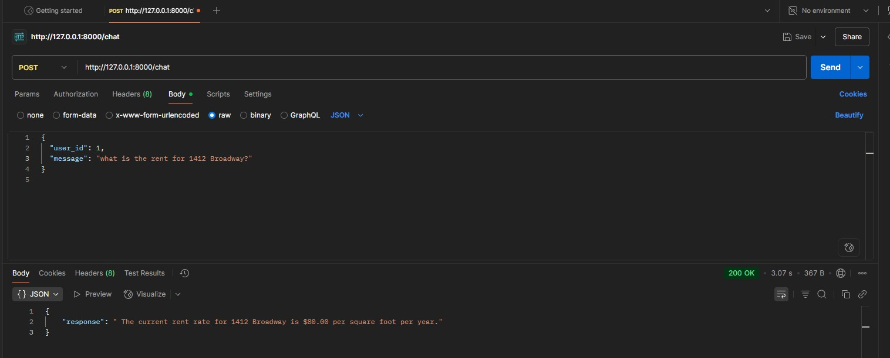
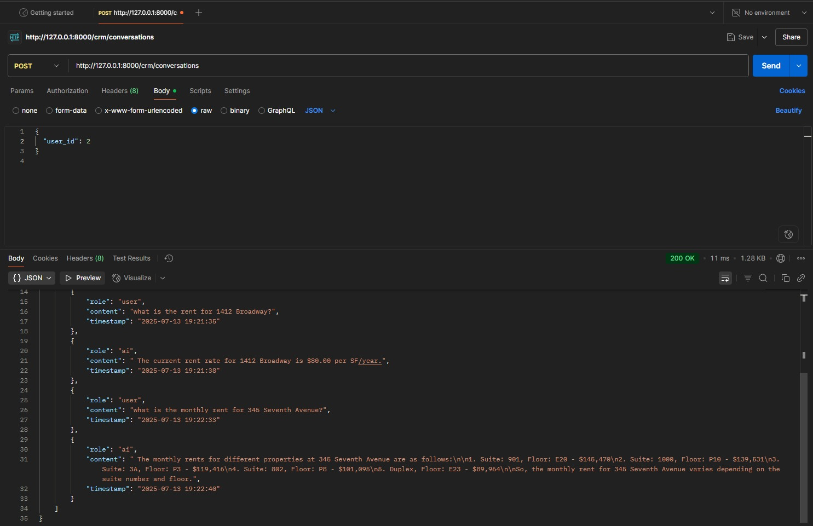
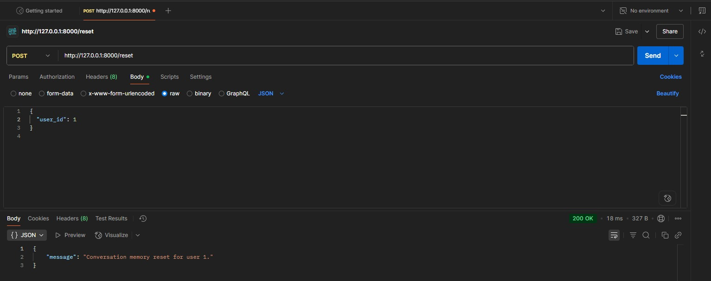
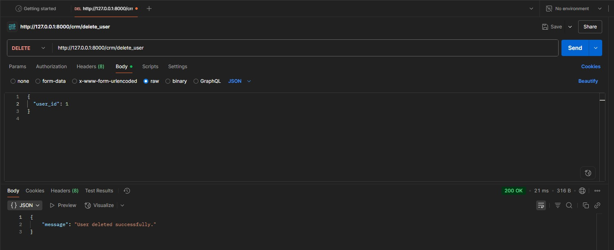

# 🧠 Multi-Agentic Conversational AI System

A lightweight **multi-agent conversational backend** powered by **LangChain**, **Ollama**, and **FAISS**, supporting:

- Conversational memory per user
- CSV-based document retrieval using **RAG (Retrieval-Augmented Generation)**
- User management (CRUD) via CRM endpoints
- Built fully in **Django**, with no frontend or GPU required

> ✅ Designed for **API-only** usage with tools like **Insomnia** or **Postman**  
> ⚙️ Powered by **Ollama** (e.g., `mistral`, `phi3:mini`) for local LLM inference

---

## 🏗 Project Structure

```
agenticsys/
├── core/
│   ├── models.py              # DB Models (User, Messages)
│   ├── views.py               # All API views
│   ├── urls.py                # Endpoint mappings
│   ├── langchain_rag.py       # LangChain logic for RAG + FAISS
├── db.sqlite3                 # Local SQLite DB
├── requirements.txt
├── manage.py
└── README.md
```

---

## ⚙️ Setup Instructions (No GPU, No Frontend)

### ✅ 1. Clone the repository

```bash
git clone https://github.com/HarshaKoduri123/Multi-Agentic-Conversational-AI-System.git
cd Multi-Agentic-Conversational-AI-System
```

---

### ✅ 2. Create & activate virtual environment

```bash
python -m venv venv
venv\Scripts\activate         # On Windows
# source venv/bin/activate    # On Linux/macOS
```

---

### ✅ 3. Install requirements

```bash
pip install --upgrade pip
pip install -r requirements.txt
```

---

### ✅ 4. Install and run Ollama

1. Download and install from: https://ollama.com/download
2. In a new terminal:

```bash
ollama serve
ollama run mistral
```

> You can also use other models like `phi3:mini` which are smaller and lighter.

---

### ✅ 5. Initialize Django database

```bash
python manage.py makemigrations
python manage.py migrate
```

Optional: Create a superuser

```bash
python manage.py createsuperuser
```

---

### ✅ 6. Start the Django server

```bash
python manage.py runserver
```

Access the API at: `http://127.0.0.1:8000/`

---

## 🔌 API Endpoints

| Endpoint                         | Method | Description                                |
|----------------------------------|--------|--------------------------------------------|
| `/chat`                          | POST   | Send message and get response from RAG/LLM |
| `/upload_docs`                   | POST   | Upload CSV knowledge base                  |
| `/crm/create_user`               | POST   | Create user profile                        |
| `/crm/update_user`               | PUT    | Update user info                           |
| `/crm/delete_user`               | DELETE | Delete a user                              |
| `/crm/conversations`             | POST   | Get conversation history of a user         |
| `/reset`                         | POST   | Reset memory (WIP)                         |

---

## Requests and Responses

- Create User


- Update User


- Upload Docs


- Chat


- Get Converstion


- Reset Converstion


- Delete User



---

## ✅ Features

- RAG-enhanced document search via LangChain
- Lightweight FAISS vector store
- In-memory chat history via `ConversationBufferMemory`
- Tracks every user’s messages via `ConversationMessage` model
- Uses `ChatOllama` to run models like `phi3:mini` or `mistral` locally

---

## 🚀 Future Improvements

- Per-user memory isolation
- Agent routing for multi-agent use cases
- Simple web-based chat UI (React or HTMX)
- Dockerized backend

